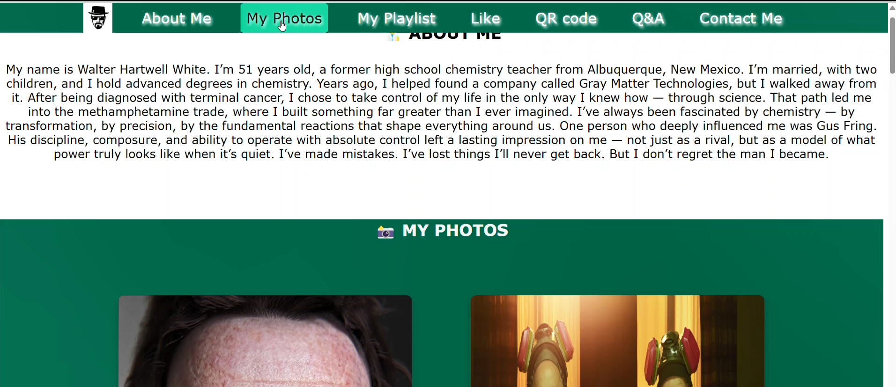

# Walter White – Character Presentation Website

### Made By:

Tom Badash
318317526

🔗 [Live Project](https://wed-2023.github.io/318317526/)

## 🎬 Website Demonstration

Click the image below to watch a short demo of the Walter White website:

## 📚 Project Overview

This project is a character-based website built as part of a web development assignment.  
The focus of the site is **Walter White**, the iconic character from the TV series _Breaking Bad_.

The goal of the project was to apply modern HTML5, CSS3, and basic JavaScript concepts to create a stylish, interactive, and semantically structured website that introduces the character and engages the user.

---

### 📄 Structure

- A multi-section website introducing Walter White
- Semantic HTML5 elements like `<section>`, `<header>`, etc.
- Responsive layout and basic accessibility

### ✨ Features

- **About Me Section** – written from the character’s point of view
- **Photo Gallery** – responsive images with styling and hover effects
- **Like Button** – interactive heart button with crystal-like glowing animation on each click
- **QR Code Section** – scannable code displayed in a centered layout
- **Contact Me Form** – includes email and message fields, with emoji picker support
- **Q&A Section** – includes HTML table comparing Web 1.0, Web 2.0, and Web 3.0 + use case

### 🎨 Styling & Effects

- CSS3 transitions and keyframe animations
- Button glow effects
- Smooth font styling, shadows, and layout responsiveness
- Custom design choices to match Breaking Bad’s atmosphere

---

## 💡 Technologies Used

- **HTML5** – Semantic structure
- **CSS3** – Styling, animations, layout
- **JavaScript (Vanilla)** – Interactivity (like button, emoji picker)
- **GitHub Pages** – Hosting the final result

---

## 🙌 Created By

This project was created as part of a university assignment for the Web Development course.
